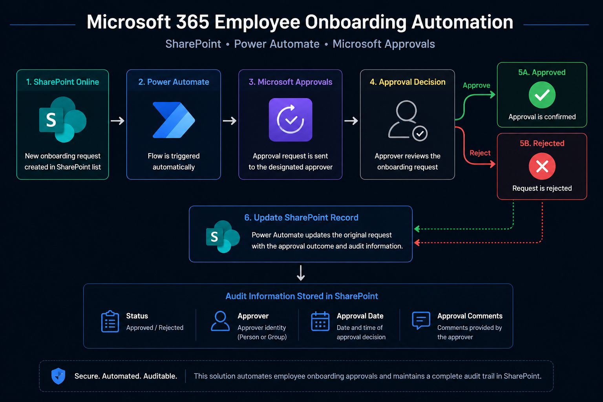

# Microsoft 365 Employee Onboarding Automation

An end-to-end Microsoft 365 employee onboarding approval solution built with SharePoint Online, Power Automate, and Microsoft Approvals.

The solution automates onboarding requests from submission through approval, decision processing, SharePoint updates, and approval audit tracking.

---

## Overview

This project demonstrates a practical Microsoft 365 business process automation solution.

A SharePoint Online list acts as the primary data layer for employee onboarding requests. When a new request is submitted, Power Automate automatically initiates an approval workflow.

The approver can approve or reject the request through Microsoft Approvals. Power Automate then processes the decision and updates the original SharePoint record with the final status and approval metadata.

---

## Architecture

### Workflow

SharePoint Online  
↓  
Employee Onboarding Request  
↓  
Power Automate Trigger  
↓  
Microsoft Approvals  
↓  
Approval Decision  
↓  
Approve / Reject  
↓  
SharePoint Record Update  
↓  
Audit Metadata

---

## Technologies

- Microsoft 365
- SharePoint Online
- Microsoft Lists
- Power Automate
- Microsoft Approvals
- Microsoft Entra ID

---

## SharePoint Data Model

The `Employee Lifecycle Requests` list stores structured onboarding information.

### Request Data

- Title
- Request Type
- Employee Name
- Department
- Job Title
- Manager
- Start Date
- Employment Type
- Location
- Equipment Required

### Workflow Data

- Status
- Approver
- Approval Date
- Approval Comments

The workflow-controlled fields are separated from the standard request-entry experience so they are managed by automation rather than manually entered by users.

---

## Power Automate Workflow

The automation performs the following sequence:

1. Detects creation of a new SharePoint onboarding request.
2. Retrieves the onboarding request data.
3. Creates an approval request through Microsoft Approvals.
4. Sends the request to the designated approver.
5. Waits for the approval decision.
6. Evaluates the returned outcome.
7. Routes processing through the Approved or Rejected branch.
8. Updates the original SharePoint record.
9. Stores approval metadata for audit purposes.

---

## Approval Logic

### Approved

When the approver selects `Approve`:

- Status is changed to `Approved`
- Approver identity is recorded
- Approval date is captured
- Approval comments are stored when provided

### Rejected

When the approver selects `Reject`:

- Status is changed to `Rejected`
- Approver identity is recorded
- Approval date is captured
- Rejection comments are stored

---

## Audit Trail

Each processed request can maintain the following workflow-generated metadata:

| Field | Purpose |
|---|---|
| Status | Current approval state |
| Approver | Identity of the person who responded |
| Approval Date | Date of the approval decision |
| Approval Comments | Comments submitted with the decision |

This creates a structured approval history directly within the SharePoint record.

---

## Testing and Validation

The solution was validated using multiple end-to-end onboarding requests.

### Approved Path

Validated successfully:

- SharePoint trigger execution
- Approval request creation
- Approval response processing
- Conditional Approved branch
- Status update to `Approved`
- Approver identity capture
- Approval date capture
- Approval comments capture

**Result:** Passed

### Rejected Path

Validated successfully:

- SharePoint trigger execution
- Approval request creation
- Rejection response processing
- Conditional Rejected branch
- Status update to `Rejected`
- Approver identity capture
- Approval date capture
- Rejection comments capture

**Result:** Passed

### Additional Validation

Also verified:

- Required SharePoint fields remain intact after workflow updates
- Approver is stored using a Person or Group field
- Both conditional branches execute correctly
- Power Automate run history completes successfully
- Approval processing works from mobile
- Workflow-managed fields can be hidden from the standard request form
- Renaming the Approver display name does not break workflow processing

---

## Key Features

- Automated employee onboarding requests
- SharePoint-based request management
- Microsoft Approvals integration
- Approve and Reject decision branches
- Automatic SharePoint updates
- Approver identity tracking
- Approval date capture
- Approval comment capture
- Structured audit trail
- Mobile approval processing
- End-to-end workflow validation

---

## Documentation

Detailed technical documentation is available in the `docs` directory:

- [Solution Architecture](docs/architecture.md)
- [SharePoint Data Model](docs/sharepoint-schema.md)
- [Power Automate Workflow](docs/workflow.md)
- [Testing and Validation](docs/testing.md)

---

## Project Structure

    m365-employee-onboarding-automation/
    │
    ├── README.md
    │
    ├── assets/
    │   └── architecture.png
    │
    └── docs/
        ├── architecture.md
        ├── sharepoint-schema.md
        ├── workflow.md
        └── testing.md

---

## Security and Privacy

This repository contains sanitized project documentation intended for portfolio and technical demonstration purposes.

The repository intentionally excludes:

- Production credentials
- Passwords
- Access tokens
- Tenant IDs
- Internal SharePoint URLs
- Confidential organizational data
- Real employee records
- Sensitive Microsoft 365 configuration details

Workflow authentication remains within Microsoft 365 services and is not stored in this repository.

---

## Future Enhancements

Planned extensions include:

- Power Apps onboarding front end
- Employee request dashboard
- Role-based views
- Multi-stage approval workflows
- Equipment provisioning automation
- Microsoft Teams notifications
- Onboarding task tracking
- Employee offboarding workflow
- Reporting and analytics

A future Power Apps interface can use the existing SharePoint and Power Automate solution as its backend without rebuilding the core approval workflow.

---

## Project Status

**Core Workflow:** Completed  
**Approved Path:** Validated  
**Rejected Path:** Validated  
**Audit Tracking:** Validated  
**Mobile Approval:** Validated  
**Documentation:** Completed  

**Overall Status: Completed and Portfolio Ready**

---

## Author

**Sam Etemad**

IT Infrastructure & Cloud Security Specialist
