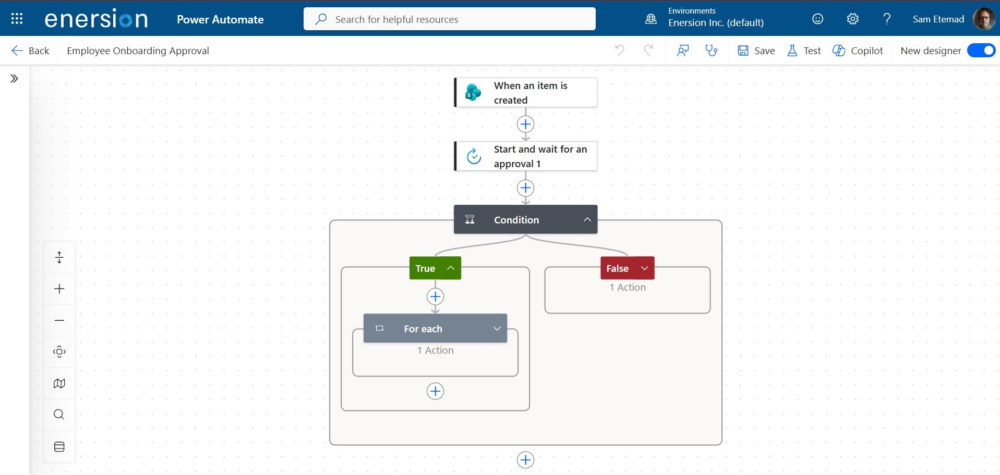
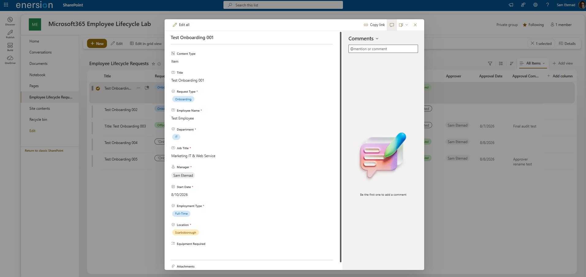
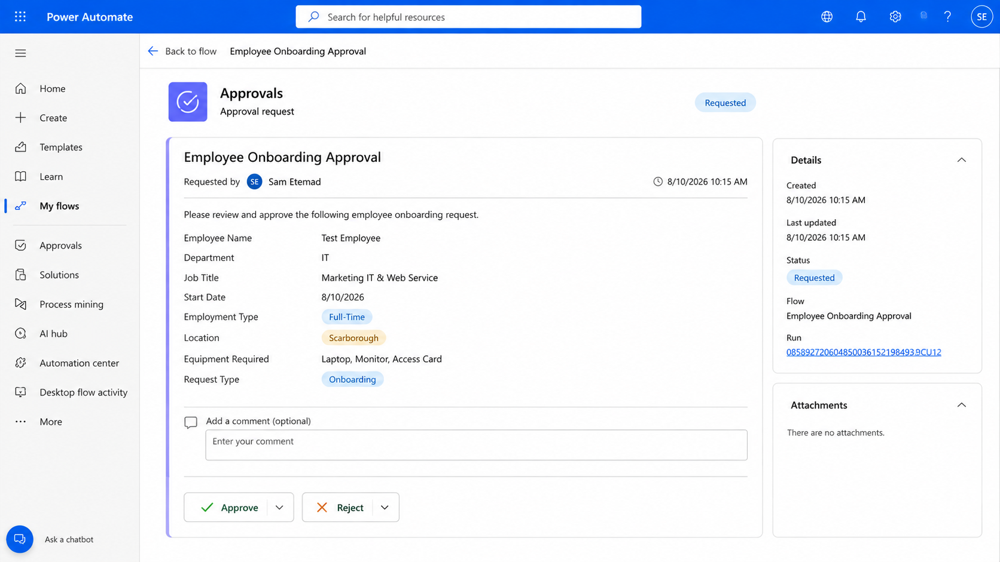

# Microsoft 365 Employee Onboarding Automation

An end-to-end employee onboarding approval solution built with **Microsoft 365, SharePoint Online, Power Automate, and Microsoft Approvals**.

The solution automates onboarding requests from submission through approval, decision processing, SharePoint updates, and structured audit tracking.

---

## Overview

This project demonstrates a practical Microsoft 365 business process automation solution.

A SharePoint Online list acts as the primary data layer for employee onboarding requests. When a new request is submitted, Power Automate automatically initiates an approval workflow.

The approver can approve or reject the request through Microsoft Approvals. Power Automate then evaluates the decision and updates the original SharePoint record with the final status and approval metadata.

### End-to-End Process

`Request → Automation → Approval → Decision → SharePoint Update → Audit Trail`

---

## Architecture

The solution separates request data, workflow processing, approval decisions, and audit information into a structured Microsoft 365 workflow.

### Process Flow

SharePoint Online  
↓  
Employee Onboarding Request  
↓  
Power Automate Trigger  
↓  
Microsoft Approvals  
↓  
Approval Decision  
↓  
Approve / Reject  
↓  
SharePoint Record Update  
↓  
Audit Metadata

---

## Technologies

- Microsoft 365
- SharePoint Online
- Microsoft Lists
- Power Automate
- Microsoft Approvals
- Microsoft Entra ID

---

## Power Automate Workflow

The workflow is triggered automatically when a new employee onboarding request is created.

### Workflow Sequence

1. A new onboarding request is created in SharePoint.
2. Power Automate detects the new list item.
3. The workflow creates an approval request.
4. Microsoft Approvals sends the request to the designated approver.
5. The workflow waits for the approval response.
6. A condition evaluates the returned decision.
7. Processing is routed through the Approved or Rejected branch.
8. The corresponding SharePoint record is updated.
9. Approval metadata is stored for audit purposes.

---

## Approval Experience

The approver receives a structured approval request containing the employee onboarding information required to make a decision.

The approver can:

- Review onboarding information
- Approve the request
- Reject the request
- Add approval or rejection comments

The workflow waits for the decision before continuing.

---

## Approval Logic

### Approved Path

When the approver selects `Approve`:

- Status changes to `Approved`
- Approver identity is recorded
- Approval date is captured
- Approval comments are stored when provided

### Rejected Path

When the approver selects `Reject`:

- Status changes to `Rejected`
- Approver identity is recorded
- Approval date is captured
- Rejection comments are stored

---

## SharePoint Results and Audit Trail

After the approval decision is processed, Power Automate updates the original SharePoint record automatically.

The workflow maintains structured audit metadata for each request.

| Field | Purpose |
|---|---|
| Status | Current approval state |
| Approver | Identity of the person who responded |
| Approval Date | Date of the approval decision |
| Approval Comments | Comments submitted with the decision |

This provides a centralized approval record directly within SharePoint.

---

## SharePoint Data Model

The `Employee Lifecycle Requests` list stores both onboarding request information and workflow-generated metadata.

### Request Data

- Title
- Request Type
- Employee Name
- Department
- Job Title
- Manager
- Start Date
- Employment Type
- Location
- Equipment Required

### Workflow Data

- Status
- Approver
- Approval Date
- Approval Comments

Workflow-controlled fields are separated from the standard request-entry experience so approval metadata is managed by automation rather than manually entered by users.

---

## Key Features

- Automated employee onboarding workflow
- SharePoint-based request management
- Microsoft Approvals integration
- Approve and Reject decision branches
- Automatic SharePoint record updates
- Approver identity tracking
- Approval date capture
- Approval comments capture
- Structured audit trail
- Mobile approval processing
- Workflow-controlled audit fields
- End-to-end validation

---

## Testing and Validation

The solution was validated using multiple end-to-end onboarding requests.

### Approved Scenario

Successfully validated:

- SharePoint trigger execution
- Approval request generation
- Approval response processing
- Approved conditional branch
- Status update to `Approved`
- Approver identity capture
- Approval date capture
- Approval comments capture

**Result: Passed**

### Rejected Scenario

Successfully validated:

- SharePoint trigger execution
- Approval request generation
- Rejection response processing
- Rejected conditional branch
- Status update to `Rejected`
- Approver identity capture
- Approval date capture
- Rejection comments capture

**Result: Passed**

### Additional Validation

Also verified:

- Required SharePoint fields remain intact after workflow updates
- Approver is stored using a Person or Group field
- Both conditional branches execute correctly
- Power Automate run history completes successfully
- Approval processing works from mobile
- Workflow-managed fields can be hidden from the standard request form
- Approver display-name changes do not break workflow processing

---

## Documentation

Detailed technical documentation is available in the `docs` directory:

- [Solution Architecture](docs/architecture.md)
- [SharePoint Data Model](docs/sharepoint-schema.md)
- [Power Automate Workflow](docs/workflow.md)
- [Testing and Validation](docs/testing.md)

---

## Project Structure

    m365-employee-onboarding-automation/
    │
    ├── README.md
    │
    ├── assets/
    │   ├── architecture.png
    │   ├── workflow-overview.png
    │   ├── approval-request.png
    │   └── sharepoint-approval-results.png
    │
    └── docs/
        ├── architecture.md
        ├── sharepoint-schema.md
        ├── workflow.md
        └── testing.md

---

## Security and Privacy

This repository contains sanitized project documentation intended for technical demonstration and portfolio purposes.

The public repository intentionally excludes:

- Production credentials
- Passwords
- Access tokens
- Tenant IDs
- Internal SharePoint URLs
- Organizational email addresses
- Confidential employee information
- Production employee records
- Sensitive Microsoft 365 configuration details

Workflow authentication remains within Microsoft 365 services and is not stored in this repository.

---

## Future Enhancements

### Power Apps Front End

A Power Apps interface can provide a dedicated user experience for submitting and tracking employee lifecycle requests.

### Employee Offboarding

The lifecycle solution can be extended to support:

- Offboarding requests
- Last working date tracking
- Microsoft 365 account disablement tasks
- Session and access revocation
- Group and application access removal
- Equipment return tracking
- Access card and key recovery
- Offboarding completion verification

### IT Provisioning

Approved onboarding requests can automatically generate downstream IT provisioning tasks such as:

- Laptop preparation
- Account provisioning
- Microsoft 365 access
- Security group assignment
- Equipment assignment
- Access card provisioning

### Additional Enhancements

- Multi-stage approvals
- Role-based request views
- Microsoft Teams notifications
- Onboarding task tracking
- Equipment lifecycle management
- Reporting and analytics
- Power BI dashboard integration

---

## Roadmap

**Phase 1 — Onboarding Approval & Audit Trail**  
Completed

**Phase 2 — Employee Offboarding Automation**  
Planned

**Phase 3 — Power Apps Lifecycle Interface**  
Planned

**Phase 4 — IT Provisioning & Equipment Tracking**  
Planned

**Phase 5 — Reporting & Lifecycle Dashboard**  
Planned

---

## Project Status

**Core Workflow:** Completed  
**Approved Path:** Validated  
**Rejected Path:** Validated  
**Audit Tracking:** Validated  
**Mobile Approval:** Validated  
**Technical Documentation:** Completed  
**Visual Documentation:** Completed  

**Overall Status: Phase 1 Completed and Portfolio Ready**

---

## Author

**Sam Etemad**

IT Infrastructure & Cloud Security Specialist
